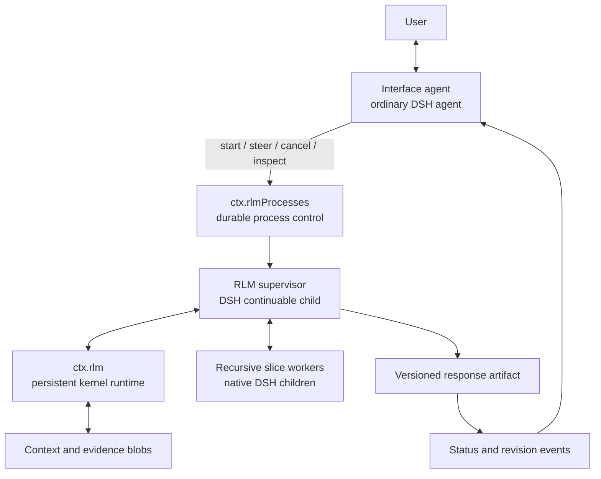

# Architecture

Status: target architecture for the post-preview implementation  
Last reviewed: 2026-08-31

This document is the short map of DeepSeek RLM: what the system does, which
part owns each responsibility, and where a change belongs. The current preview
contract remains in `SPEC.md`; planned migrations and their acceptance criteria
live in `MILESTONES.md`.

## Bird's-eye view

DeepSeek RLM lets a DeepSeek Harness (DSH) agent treat a large body of context
as data in a persistent Python environment instead of placing the entire body
in every model request. The agent can inspect and slice that context, delegate
focused questions to native DSH children, and assemble a durable, revisioned
response artifact.

The future asynchronous workflow separates the user conversation from the
long-running RLM process:

The interface agent is not a second hidden orchestrator. It is the ordinary,
user-facing DSH agent. It starts a separate supervisor child and becomes idle
again, so it can answer new user messages while the child works. The harness
may wake it for meaningful process events; no model needs to poll continuously.

The RLM supervisor is also an ordinary DSH agent. It uses the persistent kernel
and native subagents, but DSH remains the only component that creates model
requests or drives agent turns.

## Vocabulary

- **Interface agent:** the user-facing DSH agent that starts and controls an
  RLM process. It is invoked by a user message or a meaningful process event.
- **RLM process:** one durable long-context task, including its query, context
  reference, supervisor, budgets, commands, evidence, and response artifact.
- **Supervisor:** the continuable DSH child responsible for inspecting context,
  delegating slice work, reconciling evidence, and revising the artifact.
- **Worker:** a native DSH child given a bounded question or slice. A worker
  reports findings through DSH's subagent services.
- **Kernel:** one persistent IPython/Jupyter process owned by one live DSH
  agent. It executes code but never calls a model provider directly.
- **Context reference:** a durable handle to large input. Small inputs may be
  materialized as a Python string; large inputs use a read-only, sliceable
  object so inspection does not require copying the whole value into a prompt.
- **Response artifact:** the user-visible answer under construction. It is a
  sequence of immutable revisions with evidence and provenance metadata.

## Ownership and boundaries

| Concern                                                      | Owner                                                   |
| ------------------------------------------------------------ | ------------------------------------------------------- |
| User conversation and presentation                           | Interface agent and the active DSH surface              |
| Parent, supervisor, and worker model loops                   | DSH Agent and agent-loop services                       |
| Child identity, lineage, depth, follow-up, and cancellation  | `ctx.subagents`                                         |
| Model selection, credentials, and usage                      | `ctx.llm` and DSH configuration                         |
| Tool policy, approval, logging, and telemetry                | `ctx.tools`                                             |
| Persistent kernel lifecycle and namespace snapshots          | `ctx.rlm` provider                                      |
| RLM process state transitions and artifact revision protocol | planned `ctx.rlmProcesses` service                      |
| Small durable metadata                                       | `ctx.storageDomain`                                     |
| Large contexts, snapshots, evidence, and artifact bodies     | digest-addressed artifact/blob storage                  |
| Live background status and completion notification           | optional `ctx.jobs` mirror; never the durable authority |

There are four important API boundaries:

1. `ctx.rlm` is the low-level, provider-neutral persistent-kernel seam. It has
   no model-selection or orchestration policy.
2. The kernel-to-host `host.request` protocol translates Python requests into
   public DSH services using the exact originating `Agent` as authority.
3. The planned `ctx.rlmProcesses` service owns durable RLM process commands and
   state. Its implementation composes `ctx.rlm`, `ctx.subagents`, storage, and
   artifacts; it does not implement an agent loop.
4. Model-facing tools are consumers of those services. They do not own kernel,
   process, child, or storage state.

`ctx.codeRuntime` deliberately remains separate. Its DSH contract isolates
one-shot executions and forbids cross-run state; changing it into a REPL would
weaken that boundary for unrelated consumers.

## Code map

### Current preview

`packages/rlm` defines the `RlmRuntime` service, execution and kernel types, and
RLM lifecycle vocabulary. Start here when changing the public persistent-kernel
contract.

`packages/rlm-jupyter` is the concrete provider:

- `index.ts` composes configuration, kernel ownership, and service lifecycle.
- `kernel.ts` owns Jupyter processes, channels, cell serialization, interrupt,
  restart, and generation fencing.
- `protocol.ts` and `byte-buffer.ts` own authenticated Jupyter framing and
  bounded message assembly.
- `host.ts` validates kernel requests and translates them to `ctx.llm`,
  `ctx.subagents`, and `ctx.tools`.
- `snapshot.ts` serializes namespace values and restores them without replay.
- `python.ts` provisions and probes the managed Python environment.

`packages/tool-ipython` is the model-facing consumer of `ctx.rlm`. It registers
the exclusive `ipython` tool and supplies prompt guidance.

`python/dsh-rlm-runtime` contains project-owned kernel bridge modules. The
top-level modules `agent_message` and `dsh_tools` are thin clients of
`host.request`.

`packages/prime-runtime` and `vendor/prime-agent-runtime` are transitional.
They stage the Prime-compatible Python callable, local harness-state helper,
and supporting code. The target architecture replaces them with an owned
runtime-assets package and removes Prime from the production dependency graph.

`packages/bundle` composes the Cordis providers and consumers into a DSH bundle.
Its spawn provider must remain a native DSH provider.

`patches/deepseek-harness` contains compatibility changes for the pinned
alpha.3 baseline. No package may reach into DSH private continuation state as an
alternative to these public seams.

`tests`, `scripts`, and `provenance` cover cross-package behavior, packaging,
upstream pins, patch application, and licensed copied code.

### Planned additions

The exact package names may change during implementation, but these boundaries
should remain recognizable:

- `packages/runtime-assets` replaces `packages/prime-runtime` and stages only
  project-owned Python code and locked third-party Python dependencies.
- `packages/rlm-process` defines and provides `ctx.rlmProcesses`, the durable
  process state machine, context handles, commands, evidence records, and
  artifact revision protocol.
- `packages/tool-rlm` exposes asynchronous `rlm_start`, `rlm_status`,
  `rlm_steer`, `rlm_cancel`, and `rlm_result` tools to an interface agent.
- The bundle composes the process layer only when storage, artifact, subagent,
  and notification capabilities are available.

The canonical RLM workflow belongs in the process layer, not in `ctx.rlm`.
This keeps persistent Python useful on its own and allows another kernel
provider to implement the same low-level service later.

## Principal flows

### Persistent cell execution

The `ipython` tool passes the exact calling `Agent`, call id, abort signal, and
code to `ctx.rlm.execute`. The provider lazily creates that agent's kernel,
executes one serialized cell, collects bounded output, snapshots settled state,
and returns through the ordinary DSH tool pipeline.

### Recursive delegation

Python `await rlm(prompt, ...)` sends an authenticated `host.request`. The host
validates the payload, lineage, depth, and exact model selection, then calls
`ctx.subagents.startContinuable`. The returned object is an admission handle,
not the child's answer. Reports and follow-ups continue through public DSH
subagent services.

### Asynchronous RLM process

1. The interface agent calls `rlm_start` with a query and context reference.
2. `ctx.rlmProcesses` durably records the process before admitting work and
   creates a continuable supervisor child.
3. The start call returns a stable process handle immediately. The interface
   agent can respond to the user and become idle.
4. The supervisor receives `query` and `context` in its persistent namespace.
   It searches or slices the context, delegates bounded investigations, and
   records evidence.
5. Only the supervisor commits response-artifact revisions. Each commit names
   its parent revision and evidence inputs.
6. The harness delivers significant status or revision events to the active
   surface. It invokes an interface model only when a user or policy decision
   requires one.
7. User steering becomes a durable, ordered command. The supervisor applies it
   at a checkpoint and records which command sequence affected a revision.
8. Finalization commits an immutable final revision and a terminal process
   state. Cancellation is terminal but preserves artifacts and diagnostics.

### Recovery

Process-local registries and live kernels are caches. After restart, the
provider reconstructs kernel state from an authorized snapshot, while the
process controller reconstructs jobs, commands, and artifact heads from
`ctx.storageDomain`. DSH reconstructs supervisor and worker conversations from
their Sessions. Historical Python cells are never replayed.

## Durable state model

Large bytes and queryable metadata have different storage needs:

- Blob storage contains immutable, digest-addressed context bodies, namespace
  snapshots, evidence attachments, and artifact bodies.
- `ctx.storageDomain` contains versioned records for kernel snapshot heads,
  RLM processes, commands, artifact revisions, ownership, and state changes.
- DSH Session logs remain authoritative for model-visible conversation and
  tool history. RLM metadata does not need custom Session events to be durable.

A blob commit follows this order:

1. Write a bounded temporary blob and atomically install it under its digest.
2. Verify the digest and media metadata on the host side.
3. Commit a storage-domain record that authorizes that digest.
4. Publish the resulting domain or process event.

An unreferenced blob is an orphan eligible for later garbage collection. A
metadata record whose blob is missing or corrupt produces a diagnostic and
must not be loaded. `dill` data is trusted executable state; digest integrity
does not make an untrusted snapshot safe.

The response artifact uses single-writer, compare-and-swap revisions. The
interface agent and users append steering commands; they do not edit the live
artifact behind the supervisor's back. This prevents lost updates and makes
every displayed draft reproducible.

## Architecture invariants

- DSH is the only code that creates and drives model loops. Python, the process
  controller, and the interface layer never call a model provider directly.
- No production path launches Prime Agent, ACP, or a Prime `AgentSession`.
- The interface agent is an ordinary, on-demand DSH agent, not a continuously
  running model or a second scheduler.
- Starting an RLM process does not block the interface agent until completion.
- `ctx.rlm` remains provider-neutral and separate from `ctx.codeRuntime`.
- One exact live DSH `Agent` owns at most one live kernel. Cells in that kernel
  are FIFO; different agents may execute concurrently.
- The exact live `Agent` that originated a Python request is its authority.
  Python cannot nominate another agent as its credential.
- Kernel generation, RLM process revision, and steering command sequence are
  fenced independently. Stale work cannot commit into a newer generation.
- RAM is never the sole authority for recoverable state. Process-local jobs,
  kernel objects, and event subscriptions may disappear without losing the
  last committed revision.
- Namespace recovery loads authorized values; it never replays historical
  cells or their side effects.
- The response artifact has one writer. Steering is ordered input, not an
  out-of-band mutation.
- Large context stays outside model history unless an agent deliberately sends
  a bounded slice to a model.
- IPython has the kernel process's OS authority. Only operations routed through
  `dsh_tools.call()` receive DSH tool policy and approval.
- Credentials, complete environment values, source context, and artifact bodies
  never enter lifecycle events or routine logs.
- Missing correctness-sensitive capabilities fail explicitly. There is no
  private-state fallback and no silent model, policy, or persistence downgrade.

## Cross-cutting concerns

### Cancellation and concurrency

Cell cancellation first interrupts the kernel and then retires its generation
if it does not settle. RLM-process cancellation stops new admissions, cancels
the supervisor through public DSH services, waits a bounded interval, and
preserves the latest committed artifact. Worker results arriving after a
process or revision fence closes are retained only as diagnostics.

### Compatibility

DSH is a moving pre-release dependency. Every supported DSH release has one
exact compatibility record covering package versions, Cordis services, Loader
schema, subagent behavior, storage format, and optional capabilities. Public
capability checks may disable optional operations; they may not emulate them by
accessing private fields.

### Security

The Jupyter transport is loopback-only and HMAC-authenticated, but the kernel
is not a sandbox. A future process/container kernel provider can strengthen OS
isolation behind `ctx.rlm` without changing the process layer. All host-request
payloads, context references, artifact paths, and ownership relationships are
validated in TypeScript before use.

### Observability

Structured events identify session, process, generation, revision, operation,
duration, byte counts, and stable outcomes. They omit code, context contents,
secrets, and arbitrary exceptions. DSH remains authoritative for token and cost
accounting; the plugin correlates rather than duplicates those records.

### Testing

Tests concentrate on system boundaries:

1. `ctx.rlm` contract tests cover any kernel provider.
2. Protocol tests exercise untrusted Python-to-host requests and generation
   fencing.
3. Process tests use scripted DSH agents to verify state transitions, steering,
   revisions, recovery, and bounded context disclosure.
4. Bundle tests use a real supported DSH composition and verify teardown,
   persistence, and surface notification.

## Where to make a change

| Desired change                                 | Primary location                                             |
| ---------------------------------------------- | ------------------------------------------------------------ |
| Add or change persistent-kernel operations     | `packages/rlm`, then every provider and consumer             |
| Change Jupyter process or wire behavior        | `packages/rlm-jupyter` (`kernel.ts` / `protocol.ts`)         |
| Add a Python callable                          | owned Python runtime plus `host.ts` and protocol tests       |
| Change snapshot bytes or recovery              | `snapshot.ts`, blob commit code, and storage-domain schema   |
| Change model-visible IPython behavior          | `packages/tool-ipython`                                      |
| Change RLM process state or artifact revisions | planned `packages/rlm-process`                               |
| Change interface-agent controls                | planned `packages/tool-rlm`                                  |
| Change child lifecycle semantics               | upstream/public `ctx.subagents`, never plugin-private access |
| Change bundle order or dependencies            | `packages/bundle` and isolated package smoke tests           |

## Related documents

- `README.md` is the shortest safe path for an operator.
- `SPEC.md` is the normative contract for the current alpha.3 preview.
- `MILESTONES.md` describes how the preview evolves into this architecture.
- `patches/deepseek-harness/README.md` records the current host patch series.
- `docs/INSTALL.md` contains installation and troubleshooting details.

The structure of this document follows the architecture-map approach described
in [ARCHITECTURE.md](https://matklad.github.io/2021/02/06/ARCHITECTURE.md.html)
and exemplified by
[rust-analyzer](https://github.com/rust-lang/rust-analyzer/blob/d7c99931d05e3723d878bea5dc26766791fa4e69/docs/dev/architecture.md): a bird's-eye view, a code map, explicit boundaries and invariants, and a short account of cross-cutting concerns.
