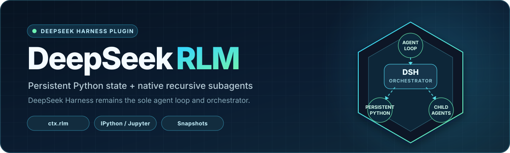

<p align="center">
  <a href="https://github.com/OpenCnid/deepseek-rlm">
    
  </a>
</p>

<p align="center">
  <a href="https://github.com/OpenCnid/deepseek-rlm/actions/workflows/ci.yml"></a>
  <a href="./LICENSE"></a>
  
  
  
</p>

# DeepSeek RLM

Give every DeepSeek Harness agent a persistent IPython workspace and the
ability to delegate focused work to native recursive subagents. DeepSeek
Harness remains the only agent loop: it owns models, tools, approvals,
sessions, policy, lineage, cancellation, and persistence.

> [!NOTE]
> **RLM** means a Recursive Language Model workflow. This is a Cordis plugin
> bundle for DeepSeek Harness—not another harness and not a DeepSeek model.

> [!IMPORTANT]
> This preview targets the exact DSH `0.1.0-rc.7` baseline and requires three
> ordered host patches. The packages are not published; install the local
> tarballs using the [installation guide](docs/INSTALL.md).

## What it adds

- **Persistent Python:** one authenticated IPython/Jupyter kernel per live DSH
  agent, with state preserved between tool calls.
- **Durable snapshots:** bounded, digest-authorized namespace snapshots restore
  variables without replaying historical cells or their side effects.
- **Native recursion:** `await rlm(...)` admits a normal DSH continuable child
  with enforced lineage, depth, model selection, and cancellation.
- **Parent/child messaging:** Prime-compatible `agent_message` calls route
  through public DSH subagent services.
- **Harness tools from Python:** optional `dsh_tools.call()` requests remain
  inside the originating tool execution and pass through DSH policy.

```text
DeepSeek Harness Agent
  └─ ipython tool → persistent Jupyter kernel → snapshots
                       └─ rlm(...) → native DSH child agent
                                        └─ agent_message → parent inbox
```

No production code starts `prime-agent`, creates a Prime `AgentSession`, calls
an LLM provider from Python, or runs a second agent loop.

## Compatibility

| Component            | Supported baseline                                           |
| -------------------- | ------------------------------------------------------------ |
| DeepSeek Harness     | `dsh-v0.1.0-rc.7` / `99f6f02` plus all three bundled patches |
| Cordis               | `4.0.1`                                                      |
| Workspace Node.js    | `>=20`                                                       |
| Full pinned DSH host | Node.js `^22.19` or `>=24`                                   |
| Package manager      | pnpm `9.14.4`                                                |
| Managed Python       | Python `3.11` through `uv`                                   |
| Prime Agent runtime  | vendored pin `f8f0036`                                       |

The DSH packages move as one audited set. Do not mix registry copies or another
release candidate into the profile.

## Quick start

Build and verify the five local packages:

```sh
git clone https://github.com/OpenCnid/deepseek-rlm.git
cd deepseek-rlm
pnpm install --frozen-lockfile
pnpm package:bundle
```

Apply the three patches under `patches/deepseek-harness/` to the exact pinned
DSH checkout, configure the generated tarballs as profile-local overrides, and
install the bundle:

```sh
dsh plugin --profile <profile> install
dsh plugin --profile <profile> add -w /absolute/path/deepseek-rlm-dsh-rlm-bundle-0.1.0-preview.0.tgz
dsh --profile <profile> --dump-default-config
```

The dump should contain one active row each for `rlm-spawn-provider`,
`rlm-jupyter`, and `rlm-ipython-tool`. Follow
[docs/INSTALL.md](docs/INSTALL.md) for the required overrides, patch commands,
runtime roots, and a complete Windows configuration.

## Use persistent Python

State survives between calls in the same agent:

```python
records = {"passed": 41, "failed": 1}
```

```python
records["passed"] + records["failed"]  # 42
```

Snapshots serialize values independently with `dill`. Missing, corrupt, or
oversized values are reported and skipped; old cells are never replayed.

## Delegate to a child agent

```python
worker = await rlm(
    "Investigate the failing test and report the smallest verified cause.",
    name="investigator",
    model="provider/model",
    thinking="high",
)
```

`rlm(...)` returns when DSH admits the child, not when the child finishes. When
`model` is omitted, the child inherits the exact active request route from the
parent session. The child reports explicitly:

```python
import agent_message
await agent_message.send("Cause: ...", receiver_role="parent")
```

The parent can continue the same child:

```python
await agent_message.send(
    "Now verify the smallest fix.",
    receiver_role="child",
    receiver_name=worker.name,
)
```

Model discovery, child listing/deletion, and optional DSH tool routing are also
available through `rlm` and `dsh_tools`; see [SPEC.md](SPEC.md) for the complete
contract.

## Security boundary

> [!WARNING]
> IPython is OS-authority code execution, not a sandbox. Python, `%%bash`, file
> access, sockets, imports, and subprocesses can bypass DSH tool guards. Only
> `dsh_tools.call()` traverses DSH restrictions, approval, logging, and
> telemetry. Use an external OS or container sandbox for untrusted code.

The kernel starts with an empty-by-default ambient environment plus explicitly
allowed values and RLM-owned paths. Provider credentials and full environment
values never enter model catalogs, lifecycle events, or snapshots.

## Validate changes

```sh
pnpm build
pnpm check
pnpm package:bundle
```

`check` covers formatting, lint, type checking, TypeScript and Python tests,
provenance, patch integrity, package metadata, real Jupyter/DSH integration,
and bundle e2e behavior. CI runs on Windows, Ubuntu, and macOS and verifies the
patch series against a fresh pinned DSH checkout.

## Packages

| Package                               | Responsibility                                           |
| ------------------------------------- | -------------------------------------------------------- |
| `@deepseek-rlm/dsh-rlm`               | Provider-neutral `ctx.rlm` service and typed events      |
| `@deepseek-rlm/dsh-rlm-jupyter`       | Jupyter transport, managed Python, bridge, and snapshots |
| `@deepseek-rlm/dsh-tool-ipython`      | Native `ipython` tool and prompt guidance                |
| `@deepseek-rlm/dsh-rlm-prime-runtime` | Reproducible Prime shim and DSH Python bridge assets     |
| `@deepseek-rlm/dsh-rlm-bundle`        | Loader-compatible DSH bundle and native spawn provider   |

## Documentation

- [Installation and troubleshooting](docs/INSTALL.md)
- [Architecture and implementation contract](SPEC.md)
- [DeepSeek Harness patch guide](patches/deepseek-harness/README.md)
- [Hardening and assembled QA evidence](docs/qa/2026-08-20-dsh-rlm-hardening.md)
- [Third-party provenance and notices](THIRD_PARTY_NOTICES.md)
- [Contributor and coding-agent guidance](AGENTS.md)

DeepSeek RLM is available under the [MIT License](LICENSE). The workspace is a
private preview package set and is not published to a registry.
