# DeepSeek RLM Cordis Plugin Specification

Status: Draft v0.1
Date: 2026-08-31
Target: DeepSeek Harness `dsh-v0.1.2-alpha.3`

## 1. Summary

Build a native Cordis capability seam that brings Prime Agent's Recursive Language Model (RLM) programming model to DeepSeek Harness while leaving DeepSeek Harness in sole control of agent orchestration.

The completed integration gives every DeepSeek Harness agent a persistent IPython kernel and an `ipython` model tool. Python code in that kernel can call the Prime-compatible `rlm` API to create, inspect, message, and delete DeepSeek Harness subagents. The Python runtime is a shim; it must never run a second agent loop or call an LLM provider directly.

This is the required architecture:

```mermaid
flowchart LR
    model["Model in DeepSeek Harness"]
    tool["Cordis ipython tool"]
    seam["ctx.rlm service"]
    kernel["Persistent Jupyter kernel"]
    py["prime-agent-runtime plus DSH bridge"]
    bridge["Authenticated host-request bridge"]
    dsh["DeepSeek Harness services"]
    children["DeepSeek Harness child agents"]

    model --> tool --> seam --> kernel --> py
    py --> bridge --> dsh
    dsh --> children
    children --> dsh
```



ACP is permitted as a development oracle and compatibility smoke test only. It is not the production architecture because launching `prime-agent --mode acp` would make Prime Agent a nested harness and would prevent DeepSeek Harness from owning the complete inner orchestration lifecycle.

## 2. Normative language

The terms MUST, MUST NOT, SHOULD, SHOULD NOT, and MAY are normative.

"RLM core" in this specification means:

- a persistent, per-agent IPython namespace;
- Prime-compatible `rlm.run`, `rlm.find_models`, `rlm.list_subagents`, and `rlm.delete_subagent` calls;
- immediate child-admission handles rather than synchronous child answers;
- recursive, concurrent DeepSeek Harness children;
- parent/child reporting and follow-up;
- kernel snapshot and restore across session resume and compaction;
- session-local `rlm.harness` state; and
- DeepSeek Harness ownership of models, tools, policy, sessions, persistence, cancellation, telemetry, compaction, and goals.

Prime-specific product surfaces such as the Prime TUI, daemon supervisor, ACP server, `/refine` implementation, and Prime heartbeat scheduler are not part of RLM core. Equivalent behavior MAY be supplied later by adapters to DeepSeek Harness services, but those components MUST NOT be imported in a way that creates a second orchestrator.

## 3. Pinned upstream baselines

Implementation and compatibility tests MUST pin these exact upstream revisions until an intentional upgrade changes this specification:

| Upstream | Revision | Release observed during research |
|---|---|---|
| DeepSeek Harness | `dd6322d604e00eec1ba5e0c8541159906a21094a` | `dsh-v0.1.2-alpha.3` |
| Prime Agent | `f8f0036cc2da1a640aad990ae8dcb7c4820ce32e` | coding-agent `0.7.3`; `prime-agent-runtime` `0.1.0` |

Normative upstream references:

- [DeepSeek Harness architecture](https://github.com/deepseek-ai/deepseek-harness/blob/dd6322d604e00eec1ba5e0c8541159906a21094a/docs/architecture.md)
- [DeepSeek Harness subagent seam](https://github.com/deepseek-ai/deepseek-harness/blob/dd6322d604e00eec1ba5e0c8541159906a21094a/packages/subagent/subagent/README.md)
- [DeepSeek Harness tool runtime](https://github.com/deepseek-ai/deepseek-harness/blob/dd6322d604e00eec1ba5e0c8541159906a21094a/packages/core/tools/README.md)
- [DeepSeek Harness bundle publishing](https://github.com/deepseek-ai/deepseek-harness/blob/dd6322d604e00eec1ba5e0c8541159906a21094a/docs/user/develop/basic/publish.md)
- [Prime Agent RLM programming model](https://github.com/PrimeIntellect-ai/prime-agent/blob/f8f0036cc2da1a640aad990ae8dcb7c4820ce32e/packages/coding-agent/docs/rlm.md)
- [Prime Agent RLM runtime architecture](https://github.com/PrimeIntellect-ai/prime-agent/blob/f8f0036cc2da1a640aad990ae8dcb7c4820ce32e/packages/coding-agent/docs/rlm-runtime.md)

Both upstream projects are MIT licensed. Any copied or adapted source MUST retain the required copyright and license notices. Every vendored file or synchronized source directory MUST record its upstream repository, revision, original path, and whether local changes exist.

Floating Git branches and unpinned Git dependencies are forbidden in release builds.

## 4. Goals

The implementation MUST:

1. Keep DeepSeek Harness as the only harness and orchestrator.
2. Provide one lazily created persistent kernel per live DeepSeek Harness `Agent`/`SessionId`.
3. Register a normal DeepSeek Harness `ipython` tool through `ctx.tools`.
4. Run recursive children through `ctx.subagents.startContinuable()` and DeepSeek Harness in-process providers.
5. Preserve DeepSeek Harness lineage, depth limits, model routing, tool restrictions, session events, cancellation, persistence, and telemetry.
6. Support multiple concurrently running RLM children while serializing cells within one kernel.
7. Restore useful Python variables after process restart without replaying historical cells.
8. Fail loudly when a requested capability cannot be honored; never silently substitute a model, reasoning level, provider, or weaker lifecycle.
9. Work on Windows, macOS, and Linux.
10. Ship as an installable DeepSeek Harness bundle and as individually composable Cordis packages.

## 5. Non-goals

The first stable release MUST NOT:

- launch Prime Agent as a subprocess for normal execution;
- import or instantiate Prime's `AgentSession`;
- use ACP as the recursive-child transport;
- make provider calls from Python;
- replay old Python cells to reconstruct state;
- claim that a local IPython process is a security sandbox;
- replace DeepSeek Harness's agent loop, session log, compaction engine, goal service, subagent registry, or policy pipeline;
- promise byte-for-byte UI parity with Prime Agent; or
- silently expose credentials or the complete host environment to Python.

## 6. Repository and package layout

The repository MUST be a pnpm workspace with this logical layout:

```text
.
├── packages/
│   ├── rlm/                    # @deepseek-rlm/dsh-rlm: Service Definition and types
│   ├── rlm-jupyter/            # @deepseek-rlm/dsh-rlm-jupyter: Service Provider
│   ├── tool-ipython/           # @deepseek-rlm/dsh-tool-ipython: model-facing Consumer
│   ├── prime-runtime/          # @deepseek-rlm/dsh-rlm-prime-runtime: Python bootstrap/install assets
│   └── bundle/                 # @deepseek-rlm/dsh-rlm-bundle and dsh.bundle.patch
├── python/
│   └── dsh-rlm-runtime/        # DSH-specific Python bridge modules
├── vendor/
│   └── prime-agent-runtime/    # exact, licensed upstream shim or deterministic synced copy
├── patches/
│   └── deepseek-harness/       # narrowly scoped upstream-ready seam changes
├── scripts/                    # provenance sync, bootstrap, and compatibility checks
├── tests/
│   └── e2e/
├── SPEC.md
└── IMPLEMENTATION_PROMPT.md
```

Package names MAY change before first publication, but package boundaries and ownership MUST remain equivalent. The Service Definition MUST NOT depend on the Jupyter provider or tool consumer.

## 7. Ownership boundary

| Concern | Owner |
|---|---|
| Parent and child agent loops | DeepSeek Harness |
| Provider/model selection and credentials | DeepSeek Harness `ctx.llm` and agent configuration |
| Child identity, lineage, depth, persistence, reports, follow-ups | DeepSeek Harness `ctx.subagents` |
| Tool registration, filtering, execution policy, and logging | DeepSeek Harness `ctx.tools` |
| Session truth and compaction | DeepSeek Harness session log and `ctx.compaction` |
| Goals | DeepSeek Harness `ctx.goals` |
| Kernel process, Jupyter transport, namespace, snapshot bytes | RLM Jupyter provider |
| Python `rlm` API and harness-state data model | Prime-compatible Python runtime |
| Translation between Python requests and host services | DSH RLM host bridge |

If a design change moves an item from the DeepSeek Harness column into Prime code, it violates this specification.

## 8. Cordis capability seam

### 8.1 Service Definition

`@deepseek-rlm/dsh-rlm` MUST augment Cordis `Context` with `ctx.rlm` and export an abstract `RlmRuntime extends Service` registered under the key `rlm`.

The public contract MUST be semantically equivalent to:

```ts
interface RlmExecuteRequest {
  readonly agent: Agent
  readonly callId: CallId
  readonly code: string
  readonly signal: AbortSignal
  readonly onOutput?: (chunk: RlmOutputChunk) => void
}

interface RlmOutputChunk {
  readonly channel: 'stdout' | 'stderr'
  readonly text: string
}

interface RlmExecutionResult {
  readonly status: 'ok' | 'error' | 'aborted'
  readonly stdout: string
  readonly stderr: string
  readonly result?: string
  readonly durationMs: number
  readonly generation: number
  readonly kernelRestarted: boolean
  readonly error?: {
    readonly name: string
    readonly message: string
    readonly traceback: readonly string[]
  }
}

interface RlmKernelInfo {
  readonly sessionId: SessionId
  readonly generation: number
  readonly state: 'starting' | 'idle' | 'busy' | 'disposing'
  readonly python: string
  readonly runtimeVersion: string
}

abstract class RlmRuntime extends Service {
  abstract execute(request: RlmExecuteRequest): Promise<RlmExecutionResult>
  abstract info(agent: Agent): RlmKernelInfo | undefined
  abstract snapshot(agent: Agent, signal?: AbortSignal): Promise<RlmSnapshotResult | undefined>
  abstract restart(agent: Agent, signal?: AbortSignal): Promise<void>
  abstract disposeAgent(agent: Agent): Promise<void>
}
```

The final concrete types MAY add fields, but MUST preserve these semantics. Runtime/program failures resolve as `RlmExecutionResult`; contract misuse and substrate failures reject. The service MUST expose no model or tool policy of its own.

### 8.2 Jupyter provider

`@deepseek-rlm/dsh-rlm-jupyter` MUST implement `ctx.rlm` and own:

- lazy kernel creation;
- Jupyter connection-file generation;
- loopback-only ZeroMQ sockets with a unique HMAC-SHA256 key;
- shell, IOPub, and control channels;
- serialized `execute_request` calls per kernel;
- stream/result/error collection;
- comm dispatch before active-execution parent filtering;
- interrupt, restart, graceful shutdown, and forced process-tree cleanup;
- bounded stderr retention;
- managed Python environment provisioning; and
- snapshot/restore.

The provider SHOULD adapt the smallest useful subset of Prime's `KernelManager`, bootstrap, and state-snapshot implementation. It MUST NOT depend on Prime's `AgentSession` or UI.

One agent maps to one live kernel. Different agents MAY execute concurrently. A single kernel MUST NOT execute two ordinary IPython cells concurrently.

### 8.3 Tool consumer

`@deepseek-rlm/dsh-tool-ipython` MUST register one tool named `ipython` through `ctx.tools.register()`.

Input:

```json
{
  "type": "object",
  "additionalProperties": false,
  "properties": {
    "code": { "type": "string" }
  },
  "required": ["code"]
}
```

The tool MUST:

- require `exec.agent`;
- pass `exec.callId`, `exec.signal`, and the exact `Agent` to `ctx.rlm.execute()`;
- remain exclusive/non-concurrency-safe within a model tool batch;
- stream progress without writing partial model messages itself;
- return structured, lossless output for successful cells and render `stdout`, `stderr`, then the final expression result;
- turn Python error and aborted statuses into normal DeepSeek Harness tool failures;
- never bypass `ctx.tools` logging for the outer `ipython` call; and
- include a system-prompt section explaining persistence, `%%bash`, RLM admission handles, explicit child reporting, and the trust boundary.

Deployments MAY expose other native tools beside `ipython`. Making `ipython` the only model-visible tool requires a future DeepSeek Harness presentation mode and is not a reason to bypass the existing tool registry.

## 9. Managed Python runtime

The provider MUST create or reuse a versioned managed environment containing:

- Python 3.11 by default;
- `ipykernel`;
- `dill`;
- `nest-asyncio`;
- the pinned Prime `prime-agent-runtime`; and
- this project's `dsh-rlm-runtime` bridge package.

`uv` SHOULD manage the environment. A user-supplied Python MAY override it only after an import probe verifies required packages. Environment markers MUST include Python version, package lock digest, Prime revision, bridge protocol version, and platform. A mismatch triggers an atomic rebuild.

The Prime runtime SHOULD remain unmodified. DeepSeek-specific behavior belongs in a separate Python package and host handlers. If upstream code must be patched, the patch and rationale MUST be recorded under `vendor/` and covered by compatibility tests.

Kernel bootstrap MUST:

1. set the session working directory;
2. set only allowlisted environment variables plus RLM-owned variables;
3. set `RLM_SESSION_DIR`, `RLM_DEPTH`, `RLM_MAX_DEPTH`, and optional harness-state paths;
4. import `asyncio` and the callable `rlm` object into the user namespace;
5. install control-channel comm handlers so a running cell can await a host reply without deadlock;
6. load configured Python bridge modules/skills; and
7. restore the latest valid namespace snapshot before accepting model code.

## 10. Host-request protocol

The kernel and host MUST use the Jupyter comm target `host.request`. Python opens one comm per request with a non-empty request `type` and a JSON object payload. The host replies on the control channel with exactly one terminal envelope:

```json
{ "status": "ok", "...": "operation fields" }
```

or:

```json
{ "status": "error", "error": "human-readable message", "code": "STABLE_CODE" }
```

For every request the host MUST create an internal context containing a unique request ID, kernel generation, cancellation signal, and `isCurrent()` check. Handlers that cross an asynchronous boundary MUST recheck cancellation and currentness before committing host state. Replies from a retired generation MUST be rejected. Duplicate comm IDs MUST not execute twice.

Disposal MUST first abort request contexts, then drain in-flight handlers for a bounded interval, then shut down the kernel. A late request from an asynchronous Python task MAY be serviced after its originating cell is idle if the kernel generation and agent remain current.

All payloads MUST be validated exactly. Unknown options fail instead of being ignored.

## 11. Required host handlers

### 11.1 `rlm.run`

Request:

```json
{
  "prompt": "string",
  "kwargs": {
    "name": "optional unique label",
    "model": "optional provider/model",
    "thinking": "optional reasoning effort"
  }
}
```

Behavior:

1. Validate the prompt, options, parent authority, and absolute delegation depth.
2. Resolve the requested model exactly or inherit the parent model. Never fall back silently.
3. Validate `thinking` against the resolved model's advertised reasoning efforts.
4. Reserve a unique parent-scoped label. Duplicate explicit names fail. Reservation MUST be atomic across concurrent `rlm.run` requests from the same parent.
5. Call `ctx.subagents.startContinuable()` using a configured in-process provider, default `rlm-spawn`, with a fresh child context, the exact parent, prompt content, child `AgentOptions`, and configured absolute `maxDepth`.
6. Return only after the child's inbox accepts the prompt. Do not wait for a model request or answer.
7. Return a Prime-compatible admission handle:

```json
{
  "rlm_child_id": "the DeepSeek Harness child SessionId",
  "name": "stable child label",
  "session_dir": "absolute plugin artifact directory for the child",
  "model": "provider/model"
}
```

The child MUST be a normal DeepSeek Harness agent. It inherits DeepSeek Harness composition and receives its own kernel lazily when it calls `ipython`.

The default maximum depth is `1`: the root may create children; those children may not recurse unless configured higher. DeepSeek Harness session lineage is the authoritative depth source. Python environment variables are informative and the host repeats the check.

### 11.2 `rlm.find_models`

Use `ctx.llm.listProviders()`, `ctx.llm.listModels(provider)`, and exact model resolution. Search is bounded and deterministic. Each result contains `provider`, `id`, `name`, and `selector` (`provider/id`). Selector parsing MUST match an advertised provider prefix and model ID rather than naively splitting on every slash, because a model ID may itself contain slashes. The default limit is 8; the configured hard maximum is 50. Active DeepSeek Harness routes are authoritative—credentials never cross into Python.

### 11.3 `rlm.list_subagents`

Use `ctx.subagents.listChildren(parent.id, signal)` and the live `ctx.agents` registry. Return direct continuable children only, plus explicit diagnostic rows where appropriate. Map a live running child to `running`, a live idle or cold-resumable child to `completed` (its current turn is complete and the conversation remains addressable), and an unreadable/corrupt diagnostic to `error`. The response MUST include stable child ID, session ID, label/name, artifact directory, and status.

### 11.4 `rlm.delete_subagent`

Resolve an exact child ID or unique direct-child label. Ambiguous names fail. Deletion MUST:

- authorize the exact direct parent;
- cancel active work;
- dispose the child's activation and descendants in child-first order;
- append a durable tombstone preventing cold resume and messaging;
- retain transcript and artifacts; and
- return the deleted child descriptor.

DeepSeek Harness alpha.3 does not expose this operation publicly. Section 14 requires a small upstream-ready service-seam addition. Reaching into continuation-manager private fields is forbidden.

### 11.5 Parent/child messages

The bridge MUST install Prime-compatible `agent_message.list_agents` and `agent_message.send` handlers when `ctx.subagents` continuation support is present.

- Child to direct parent uses `ctx.subagents.reportFrom(child, content, { delivery, signal })`.
- Parent to direct child uses `ctx.subagents.followup(parent, childId, content, ...)`.
- Listing uses `listChildren`/`listDescendants` and the live agent registry.
- The exact live sender `Agent` is the authority credential; Python cannot name an arbitrary sender.

Sibling messaging is not present in the current DeepSeek Harness public seam. It MUST either be added as an independently reviewed, lineage-authorized DeepSeek Harness operation or fail with a clear `UNSUPPORTED_RELATIONSHIP` error. It MUST NOT be emulated by bypassing parent authority.

### 11.6 DeepSeek Harness tools from Python

The DSH Python bridge SHOULD expose:

```python
await dsh_tools.list()
await dsh_tools.call("tool_name", {"argument": "value"})
```

Calls MUST route through `ctx.tools.execute()` with the calling agent, caller signal, deterministic nested call IDs, and the active `ipython` execution token. This preserves restrictions, guards, policies, logging, and telemetry.

Arbitrary tool calls are valid only while the originating `ipython` execution remains open. Late asynchronous tasks may still use lifecycle-safe handlers such as `rlm.run` and agent messaging, but MUST receive `REQUEST_SCOPE_CLOSED` if they try to attach a tool dispatch to a completed outer call.

Direct Python file, network, subprocess, and shell access does not pass through `ctx.tools`. This limitation MUST be documented and MUST NOT be represented as policy enforcement.

### 11.7 Optional DeepSeek Harness adapters

When the corresponding services are installed, the bridge MAY expose:

| Python request | DeepSeek Harness authority |
|---|---|
| `goal.get`, `goal.create`, `goal.complete` | `ctx.goals` |
| `compact.status`, `compact.run` | context meter plus `ctx.compaction` |
| `model.info` | current agent selection and `ctx.llm.resolveModelInfo()` |

`compact.run` MUST schedule compaction after the current tool/turn reaches a safe boundary; it MUST NOT synchronously wait for agent idle from inside the requesting cell.

Semantic mismatches fail loudly. For example, Prime's `token_budget` MUST NOT be silently converted into DeepSeek Harness `maxGoalRounds`.

Prime `refine.*`, `rlm_heartbeat.*`, and `agent_observe.*` are later adapters, not stable-release blockers for RLM core.

## 12. Persistence and recovery

### 12.1 Artifact layout

The provider MUST use a configured absolute artifact root and isolate files by session ID:

```text
<artifact-root>/
  sessions/<SessionId>/
    kernel-state.dill
    kernel-state.json
    harness/harness_state.json
    runtime.json
```

Paths returned to Python MUST be absolute. Artifact paths MUST never be derived from an unsanitized child label.

### 12.2 Snapshot contract

Snapshots are best-effort per top-level variable using `dill`. One unpicklable value must not fail the whole snapshot. The default caps are 256 MiB aggregate and 16 MiB per variable. `rlm`, IPython internals, live comms, file handles, sockets, tasks, and host bridge objects are excluded.

Writes MUST use a temporary file plus atomic replacement. A JSON manifest records version, Python/runtime versions, saved names, skipped names and reasons, byte count, timestamp, and SHA-256 digest.

The default policy is `after-cell`: snapshot after every settled cell before returning the tool result. Deployments MAY choose `idle` or `dispose`, but documentation must explain the larger crash-loss window. Compaction and orderly agent disposal always request a snapshot.

Restore MUST load each name independently and report failures without preventing kernel use. Historical cells MUST never be replayed because their external side effects are not idempotent.

### 12.3 Durable session events

The integration MUST augment `SessionEventMap` with versioned, lossless-JSON, log-only events:

- `rlm/kernel-generation`: kernel start/restart identity and runtime metadata;
- `rlm/kernel-snapshot`: snapshot locator, digest, byte count, saved/skipped names, and generation;
- `rlm/kernel-restore`: restored/failed names and source snapshot digest;
- `rlm/host-request`: request ID, request type, generation, duration, status, and stable error code; and
- `rlm/child-tombstone` only if the operation is not accepted into the upstream subagent event vocabulary.

These events MUST omit `surfaceOp`, so they never enter model history. The ordinary `tool/call` and `tool/result` events remain the model-visible truth for `ipython` executions. Event payloads MUST not contain source code, secrets, full environment values, or arbitrary exception objects.

The latest valid snapshot event plus its digest is authoritative. An orphan file with no matching event is ignored. A matching event whose file is missing or corrupt produces a restore diagnostic and starts an empty namespace; it does not corrupt the DeepSeek Harness session.

## 13. Lifecycle, cancellation, and concurrency

- Kernel creation is lazy and deduplicated: concurrent first calls await one startup.
- A failed startup clears its memoized promise so a later call may retry.
- Per-kernel cell execution is FIFO and serialized.
- Distinct kernels and admitted child agents may run concurrently.
- `exec.signal` abort sends a Jupyter interrupt. If the cell does not stop within `interruptGraceMs`, the provider kills the process tree, increments generation, and lazily restarts.
- Killing a kernel invalidates every in-flight host request from its generation.
- Agent disposal snapshots when possible, aborts requests, drains them for a bounded period, sends `shutdown_request`, closes sockets, and force-kills as fallback.
- Cordis plugin disposal drains all owned kernels and leaves no child processes or connection files.
- HMR replacement MUST gate a new provider on completion of the old provider's snapshot/disposal, preventing old and new kernels from racing over one snapshot.
- A configurable semaphore MUST cap concurrent kernel boots. It must cover process spawn/readiness only, not unbounded bootstrap cells.

## 14. Required DeepSeek Harness seam additions

The current preview requires two generic changes to DeepSeek Harness. They MUST be implemented as upstream-quality patches with tests and kept narrow enough to propose upstream. Alpha.3 already supplies persisted per-child reasoning effort natively.

### 14.1 Durable continuable-child deletion

Add a public operation semantically equivalent to:

```ts
ctx.subagents.deleteContinuable(
  parent: Agent,
  childId: SessionId,
  options: { signal: AbortSignal },
): Promise<DeletedSubagent>
```

It owns authorization, admission fencing, descendant drain, activation disposal, durable tombstone, catalog filtering, cold-resume refusal, and idempotency rules. The RLM plugin only translates selectors and response shape.

### 14.2 Public ignorable Session events

Add a public `Session.appendIgnorable()` operation for typed, non-surface informational events. The writer MUST use the ordinary validated append/publication path and mark the persisted envelope `ignorable: true`, allowing older readers to skip plugin-defined event types safely. The current snapshot authorization scheme requires this seam for `rlm/*` metadata.

Alpha.3's native agent/subagent vocabulary accepts a selected `ReasoningEffortId` before the child's first request, persists it in the continuable descriptor, restores it on cold resume, and applies it through model selection. The plugin MUST still validate the value against `ctx.llm.resolveModelInfo()` before child admission. Installing an `agent/request` listener after `startContinuable()` returns remains racy and forbidden.

If deletion support is absent, `rlm.delete_subagent` MUST fail with the stable unsupported-capability error. If the ignorable-event writer is absent, the provider MUST fail before recording snapshot authority through a weaker or live-only path.

## 15. Configuration

The Jupyter provider MUST validate a configuration equivalent to:

```ts
interface Config {
  python?: string
  artifactRoot?: string
  managedRuntimeRoot?: string
  subagentProvider?: string       // default: "rlm-spawn"
  maxDepth?: number               // default: 1
  maxConcurrentKernelBoots?: number // default: 4
  interruptGraceMs?: number       // default: 2_000
  shutdownGraceMs?: number        // default: 5_000
  hostRequestDrainMs?: number     // default: 5_000
  maxOutputBytes?: number         // default: 4 MiB per cell
  envAllowlist?: string[]         // default: []
  env?: Record<string, string>    // explicit additions; secret values never logged
  shellPath?: string
  commandPrefix?: string
  snapshot?: {
    policy?: 'after-cell' | 'idle' | 'dispose'
    maxBytes?: number
    maxVariableBytes?: number
  }
  adapters?: {
    tools?: boolean
    goals?: boolean
    compaction?: boolean
  }
}
```

Invalid paths, negative/unsafe numeric values, duplicate provider names, unavailable requested adapters, and unwritable roots fail during plugin startup. Optional capabilities must be explicitly enabled and must verify their required services.

The release bundle SHOULD compose:

```yaml
- insert:
    - id: rlm-spawn-provider
      name: '@deepseek-ai/dsh-subagent-spawn-in-process'
      config:
        providerName: rlm-spawn

    - id: rlm-jupyter
      name: '@deepseek-rlm/dsh-rlm-jupyter'
      config:
        subagentProvider: rlm-spawn
        maxDepth: 1

    - id: rlm-ipython-tool
      name: '@deepseek-rlm/dsh-tool-ipython'
```

The actual `dsh.bundle.patch` MUST match the pinned Loader schema and package ordering. It MUST declare every runtime dependency rather than relying on incidental dependencies of a base profile.

## 16. Security and trust posture

IPython executes model-generated Python and shell commands with the kernel process's OS authority. Jupyter/HMAC protects transport integrity; it is not a sandbox.

The implementation MUST:

- bind Jupyter ports to loopback only;
- generate a unique random HMAC key and connection directory per kernel generation;
- create connection and artifact files with user-only permissions where the platform supports it;
- pass an empty-by-default environment allowlist plus explicit RLM variables;
- never place provider credentials in Python metadata or model catalogs;
- cap output, stderr tails, snapshots, startup time, and shutdown time;
- validate every host request and authority relationship in TypeScript;
- clean up complete process trees on Windows and POSIX; and
- document that direct Python I/O bypasses DeepSeek Harness tool guards unless the whole kernel is run inside an external sandbox.

An optional sandbox-backed kernel provider MAY be added later behind the same `ctx.rlm` Service Definition.

## 17. Observability

The provider MUST emit structured Cordis lifecycle events for kernel start, ready, busy, idle, interrupt, restart, snapshot, restore, and stop. Events must identify the DeepSeek Harness session and kernel generation but omit source code and secrets.

Metrics SHOULD include startup duration, execution duration, queued execution count, output bytes, host-request duration/status, snapshot duration/bytes, active kernels, restart count, and forced-kill count.

Child token and cost accounting remains a DeepSeek Harness concern. The plugin MUST NOT duplicate or rewrite usage accounting.

## 18. Compatibility requirements

- Node.js `^22.19` or `>=24`.
- pnpm `11.7.0` for repository development.
- Python 3.11 default; Python 3.10+ only when the full dependency probe passes.
- Windows 11, current macOS, and a current Ubuntu LTS in CI.
- Windows `%%bash` requires an explicitly configured Bash executable or a discoverable Git Bash/WSL strategy; failure must be explanatory.
- No network or paid-provider credentials are required for unit and integration tests.

## 19. Test plan

### 19.1 Unit tests

Tests MUST cover:

- Cordis service registration, injection, HMR replacement, and disposal;
- exact configuration validation;
- Jupyter signing/framing and control-channel replies;
- duplicate comm suppression and stale-generation fencing;
- one lazy kernel per agent and isolation between agents;
- serialized cells and concurrent distinct kernels;
- stdout, stderr, final expressions, tracebacks, Unicode, and output caps;
- cooperative interrupt, forced restart, and process-tree cleanup;
- environment allowlisting and secret redaction;
- exact `rlm.run` option validation;
- immediate admission (the call resolves before child completion);
- model inheritance, exact override, unavailable model, and reasoning validation;
- default and raised recursion-depth limits;
- concurrent child admission;
- list, selector ambiguity, delete, tombstone, and cold-resume refusal;
- child reports and parent follow-ups with authority rejection cases;
- DSH tool bridge restrictions, logs, cancellation, and closed-scope rejection;
- atomic snapshot, per-variable skip, caps, digest validation, restore, and corrupt/missing files;
- no replay of historical cells; and
- optional goal/compaction adapter absence and semantic mismatch errors.

### 19.2 Integration tests

Use real Cordis and DeepSeek Harness services with scripted/free local LLM adapters. At minimum:

1. An agent executes `x = 41`, later executes `x + 1`, and receives `42`.
2. A session is disposed, reconstructed from persisted events/artifacts, and the restored variable remains available.
3. A Python cell calls `await rlm("reply with READY")`; the returned value is an admission handle, not `READY`.
4. The child sends an explicit report that becomes a DeepSeek Harness parent message.
5. The parent sends a follow-up and the same durable child runs another turn.
6. Three children admitted in separate calls overlap without concurrent cells in the parent kernel.
7. A child at the configured depth limit cannot recurse.
8. Deleting a child prevents subsequent follow-up and cold resume while retaining its transcript.
9. Kernel interruption followed by restart invalidates a deliberately delayed old-generation host request.
10. Plugin teardown leaves no kernel process, sockets, temp connection files, or live Cordis effects.

### 19.3 Compatibility oracle

A non-production test MAY run the pinned Prime Agent ACP mode to compare user-visible IPython and Python `rlm` response shapes. Passing that test must not introduce ACP into the production dependency graph or runtime path.

## 20. Delivery milestones

### Milestone 0 — Repository and conformance fixtures

- Bootstrap pnpm workspace, lint/typecheck/test tooling, CI, licenses, and provenance files.
- Pin DeepSeek Harness packages/revision and Prime runtime revision.
- Add protocol fixtures for Prime-compatible Python response shapes.

Exit: clean install, build, unit test, and provenance verification on Windows and Linux.

### Milestone 1 — Persistent IPython seam

- Implement Service Definition, Jupyter provider, managed runtime, and `ipython` tool.
- Support isolation, streaming, errors, cancellation, restart, and clean disposal.

Exit: persistent-variable and multi-agent-isolation integration tests pass.

### Milestone 2 — Native recursion and messaging

- Implement `rlm.run`, find/list handlers, depth/model policy, reports, follow-ups, and concurrent children through `ctx.subagents`.
- Add Python bridge package and prompt guidance.

Exit: admission-handle, explicit-report, follow-up, concurrency, and recursion tests pass with DeepSeek Harness as the only agent loop.

### Milestone 3 — Durable recovery

- Implement snapshots, manifests, events, restore diagnostics, artifact paths, and HMR fencing.
- Enable session-local `rlm.harness` storage.

Exit: process restart and compaction-resume tests pass without replaying cells.

### Milestone 4 — Full-parity seam patches

- Implement upstream-ready DeepSeek Harness deletion and public ignorable-event patches.
- Complete `rlm.delete_subagent`, snapshot-authority, and native `thinking` support.

Exit: deletion/cold-resume and first-request reasoning tests pass; no private-field access exists.

### Milestone 5 — Bundle and hardening

- Add optional DSH tool/goal/compaction adapters, bundle patch, install docs, diagnostics, limits, cross-platform CI, and end-to-end teardown checks.

Exit: Definition of Done is satisfied.

## 21. Definition of Done

The work is complete only when all of the following are true:

- DeepSeek Harness is demonstrably the only code that creates and drives parent and child model loops.
- No production code launches `prime-agent`, uses ACP for recursion, or instantiates Prime `AgentSession`.
- `ipython` state persists across calls and revives across a persisted session restart.
- The four Prime `rlm` APIs behave as specified, including durable deletion.
- Child model and reasoning selection are validated and active on the child's first request.
- Children can report, receive follow-ups, recurse within policy, and run concurrently.
- All model-visible operations are represented in DeepSeek Harness tool/session history; internal lifecycle is observable through log-only events.
- Cancellation and disposal leave no orphan processes and reject stale-generation effects.
- Direct Python OS authority and policy limitations are documented accurately.
- The bundle installs into the pinned DeepSeek Harness release with no undeclared dependency.
- Unit, integration, e2e, typecheck, lint, provenance, and cross-platform CI all pass.
- README documentation includes installation, configuration, examples, architecture, troubleshooting, security, licensing, and upgrade instructions.

## 22. Upgrade policy

Upgrading either upstream requires:

1. pinning the candidate revision;
2. rerunning host-protocol, kernel, subagent, event-vocabulary, Loader/bundle, and license compatibility tests;
3. reviewing upstream changes to Prime `prime-agent-runtime`, `KernelManager`, snapshot code, and DeepSeek Harness capability seams;
4. documenting renamed, added, or removed behavior; and
5. updating this specification before release if semantics change.

An upstream API change must fail at build or startup. Compatibility shims that silently weaken behavior are forbidden.
